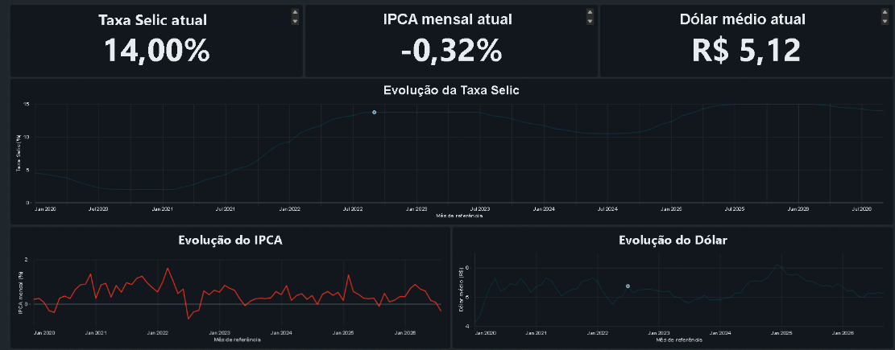
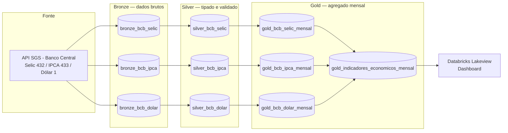
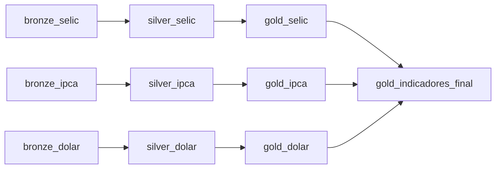

# Monitor Econômico Brasil — Indicadores BCB


Pipeline analítico de indicadores macroeconômicos brasileiros (Selic, IPCA e dólar), construído no **Azure Databricks** com **PySpark** e **Delta Lake**, seguindo a arquitetura Medallion (Bronze → Silver → Gold), com um dashboard final no Databricks Lakeview.



## O que o projeto faz

1. **Ingestão (Bronze):** consome a API SGS do Banco Central (`api.bcb.gov.br/dados/serie/...`) para três séries:
   - Selic (série 432)
   - IPCA (série 433)
   - Dólar (série 1)

   Cada carga grava os dados brutos como tabela Delta, com colunas de metadados (`indicador`, `serie_id`, `fonte`, `data_ingestao`).

2. **Tratamento e qualidade (Silver):** converte tipos (`data` para `date`, `valor` para `double`) e roda uma checagem de qualidade antes de liberar a tabela: conta linhas sem data, sem valor e registros duplicados, e **interrompe o pipeline com erro (`raise ValueError`) se algum desses casos existir**.

3. **Agregação (Gold):** agrupa os dados por mês de referência:
   - Selic e dólar: média, mínima, máxima e quantidade de observações do mês.
   - IPCA: valor mensal já é a granularidade da série, então só é arredondado e renomeado.

4. **Consolidação final:** um notebook une as três tabelas Gold mensais (`gold_bcb_selic_mensal`, `gold_bcb_ipca_mensal`, `gold_bcb_dolar_mensal`) num único indicador mensal (`gold_indicadores_economicos_mensal`), com uma flag `ipca_disponivel` para marcar meses sem divulgação do IPCA.

5. **Dashboard:** notebooks de consulta (`dashboard/notebooks`) alimentam os cards de valor atual e os gráficos de evolução histórica de cada indicador no Databricks Lakeview (`dashboard/monitor-economico-brasil-bcb.lvdash.json`).

## Arquitetura



## Stack

- **Processamento:** Azure Databricks, PySpark
- **Armazenamento:** Delta Lake (tabelas gerenciadas, arquitetura Medallion)
- **Linguagem:** Python
- **Fonte de dados:** API SGS do Banco Central do Brasil
- **Visualização:** Databricks Lakeview Dashboard

## Estrutura do repositório

```
bronze/     ingestão das 3 séries a partir da API do BCB
silver/     tipagem e validação de qualidade (nulos e duplicados)
gold/       agregação mensal por indicador + tabela final consolidada
dashboard/  notebooks dos cards/históricos e o dashboard Lakeview (.lvdash.json)
docs/       imagens
```

## Qualidade de dados

A camada Silver não é apenas tipagem: cada notebook conta explicitamente linhas com data nula, valor nulo e datas duplicadas, e **só libera a tabela se os três contadores forem zero**. Se algo estiver inconsistente, o pipeline falha de propósito, em vez de seguir com dados ruins.

## Orquestração

O pipeline é executado por um job do **Databricks Workflows** chamado `monitor_economico_bcb`, com 10 tarefas organizadas como um DAG em fan-out/fan-in:

- As três ingestões Bronze (`bronze_selic`, `bronze_ipca`, `bronze_dolar`) são independentes entre si e rodam em paralelo.
- Cada Bronze alimenta sua respectiva tarefa Silver de tipagem/validação, que por sua vez alimenta a tarefa Gold de agregação mensal correspondente.
- As três tarefas Gold convergem em uma tarefa final de consolidação, `gold_indicadores_final`.



O job roda diariamente às 05:00 (cron `41 0 5 * * ?`, fuso `America/Sao_Paulo`), em compute **Serverless** do Databricks Free Edition (sem custo), e envia notificação por e-mail em caso de falha. A definição completa do job, exportada do workspace, está em [`docs/job_definition.json`](docs/job_definition.json).

## Limitações conhecidas

- O pipeline foi desenvolvido e executado no ambiente Databricks; os notebooks aqui são o código-fonte exportado, não um projeto pronto para rodar localmente sem adaptação (workspace, cluster e permissões de API precisam ser configurados por quem for reexecutar).
- Não há testes automatizados (pytest) além das checagens de qualidade embutidas nos notebooks Silver.

## Autor

Vitor Silvestre — Engenheiro de Dados
[GitHub](https://github.com/vitorsilvestre29)
